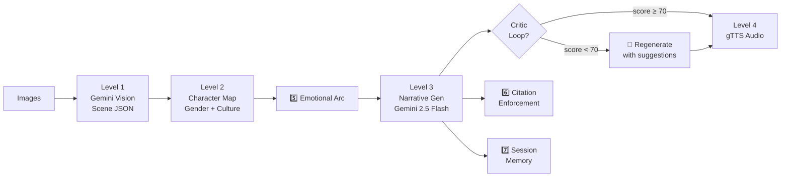

# StoryForge AI — v3.0.0

[](https://python.org)
[](https://streamlit.io)
[](https://ai.google.dev)
[](LICENSE)
[](https://your-app-name.streamlit.app)

> **A multimodal narrative intelligence system that transforms image sequences into coherent, emotionally structured stories — with citation grounding and self-refinement.**

Upload 1–10 images. The system analyses every scene with Gemini Vision, maps characters with cultural awareness, tracks the emotional arc, generates a structured narrative, critiques and improves its own output, then narrates the final story aloud — all in a single pipeline.

---

## 🌍 Live Demo

🚀 **Try it online:**
👉 https://storyforge-ai.streamlit.app/

> Deployed using Streamlit Community Cloud.
> Upload images and generate stories directly in your browser — no setup required.

<!-- --- -->

<!-- Replace the line below with your actual demo GIF -->
<!--  -->
<!-- > 📽️ **Demo GIF coming soon** — screen recording of the full pipeline in action. -->

<!-- --- -->

## 🔍 What Makes This Different From a Standard LLM App?

Most multimodal apps follow a simple pattern:

```
Image → Prompt → Story
```

StoryForge AI introduces:

- **Scene-grounded citation enforcement** — every paragraph is tied to a specific input scene
- **Explicit emotional arc modeling** — tension and resolution are guided through structured arc modeling
- **Independent critic-based evaluation** — generation and assessment are two separate model calls
- **Feature-level ablation framework** — measurable quality comparison across 3 prompt strategies
- **True token-level streaming** — live tokens from the model, not paragraph simulation
- **Structured schema output** — JSON schema enforced at generation time, eliminating formatting inconsistencies

The goal is not just generation, but measurable and controllable narrative quality.

---

## 🎯 Use Cases

| Audience | How They Use It |
|----------|----------------|
| 🎨 **Creative Writers** | Generate story drafts from a sequence of photos — travel diaries, photo albums, storyboards |
| 🎓 **Educators** | Build narrative learning tools that turn visual prompts into structured stories for students |
| 🔬 **ML Researchers** | Run built-in ablation studies to compare prompt strategies and measure coherence quantitatively |
| 🧪 **AI Evaluators** | Use the critic loop as a reference implementation of generation + independent evaluation pipelines |
| 💼 **Portfolio / GSoC** | Demonstrate production-grade multimodal AI system design with observability and self-refinement |

---

## 🏗️ Architecture Overview — 4-Level Modular Pipeline

```
┌─────────────────────────────────────────────────────────────────┐
│                   Level 1 — Core Engineering                    │
│  1️⃣ Gender-aware character mapping   2️⃣ Real tiktoken monitoring │
│  3️⃣ Structured file+console logging  4️⃣ Self-healing recovery    │
├─────────────────────────────────────────────────────────────────┤
│                  Level 2 — Narrative Intelligence               │
│  5️⃣ Scene emotional arc tracking     6️⃣ Hallucination reduction  │
│  7️⃣ Multimodal session memory                                    │
├─────────────────────────────────────────────────────────────────┤
│                   Level 3 — Research Extensions                 │
│  8️⃣ Structured JSON schema output    9️⃣ True token-level stream  │
│  🔟 3-strategy ablation study                                    │
├─────────────────────────────────────────────────────────────────┤
│                   Level 4 — Self-Refinement                     │
│  🔴 Story Critic Loop  →  Story → Critic → Improved Story       │
└─────────────────────────────────────────────────────────────────┘
```

### Pipeline Flow



---

## ✨ Feature Breakdown

### Level 1 — Scene Extraction (`vision.py`)
- Sends 1–10 PIL images to **Gemini 2.5 Flash Lite** in a single multipart request
- Returns structured JSON per image: `setting`, `characters`, `objects`, `emotions`, `time_of_day`, `key_action`
- **Retry decorator** with exponential backoff (2 retries, doubling delay)
- **Image hashing** (MD5) for cache fingerprinting — Redis-ready in production
- UI bridge callback for live status updates in Streamlit

### Level 2 — Character Mapping (`character.py`)
- **Gender/age-aware entity mapping** — splits composite fields like `"two children playing"` into individual entities
- Assigns culturally consistent **Bangladeshi names** (e.g. `Rafi`, `Nusrat`, `Karim`)
- Infers gender from contextual keywords; ensures name consistency across all scenes

### Level 3 — Narrative Generation (`narrative.py`)
- Builds a rich contextual prompt: scene JSON + character map + arc + memory + citations
- **Self-healing**: if genre-specific tags (`[MORAL]`, `[SOLUTION]`, `[TWIST]`) are missing, auto-regenerates up to 2 times
- Supports 7 styles × 4 tones × 4 narrative structures (112 combinations)
- **Structured JSON output mode**: enforces a JSON schema (`STORY_SCHEMA`) at generation time — significantly reducing formatting inconsistencies

### Level 4 — Audio (`tts.py`)
- Converts final story to audio via **gTTS**
- Strips structural tags before narration (`[MORAL]:`, `[TWIST]:`, etc.)
- Returns `BytesIO` — no temp files written to disk

---

## 🔬 Advanced Features

### 5️⃣ Emotional Arc (`coherence.py`)
Analyses per-scene emotions, maps them to valence (`positive / negative / tense / neutral`), detects transitions, and produces an `arc_summary` (e.g. `"positive → tense → resolved"`). The arc is injected into the generation prompt and used to compute a **coherence score (0–100)** after generation.

### 6️⃣ Hallucination Reduction (`hallucination.py`)
Enforces **citation tags** in the generated story (`[SCENE_1]`, `[SCENE_2]`, …). After generation, parses which scenes were cited, computes **citation coverage %**, and classifies hallucination risk (`low / medium / high`). Uncited paragraphs are flagged in the UI.

### 7️⃣ Multimodal Memory (`memory.py`)
Persists `scene_data`, `character_map`, `emotional_arc`, and the last story in a **session store** (keyed by UUID). On the next generation, the stored context is injected into the prompt so the AI continues the previous story naturally. Users can clear memory to start fresh.

### 8️⃣ Structured JSON Output (`structured_output.py`)
Defines `STORY_SCHEMA` — a JSON schema with required fields: `title`, `paragraphs[]` (each with `scene_reference[]`, `text`, `emotional_tone`), `style_tag` (`MORAL / SOLUTION / TWIST / NONE`), and `metadata`. Output is rendered to clean markdown.

### 9️⃣ True Token-Level Streaming (`streaming.py`)
| Mode | How it works | Latency |
|------|-------------|---------|
| **Token-Level (Real)** | Uses `generate_content_stream()` — tokens arrive from the model live | ~50–200 ms first token |
| **UI-Level (Simulated)** | Full response split by paragraph + `time.sleep()` delay | Full gen time + delay |

The behavioral difference between streaming modes can be explored in the **Advanced Mode** panel within the application.

### 🔟 Ablation Study (`research.py`)
Runs **3 prompt strategies** on the same scene data and compares them:

| Strategy | What's included |
|----------|----------------|
| A — Vision Only | Raw scene JSON, minimal instructions |
| B — Vision + Context | Scene JSON + citation enforcement |
| C — Full Pipeline | Scene JSON + character map + emotional arc + citations |

Metrics collected per strategy: coherence score, citation coverage %, hallucination risk, latency (ms), token cost ($).

### 🔴 Story Critic Loop — Level 4 (`critic.py` + `narrative.py`)
A **self-refinement loop** inspired by Constitutional AI and RLHF critique pipelines:

1. **Generate** initial story (standard pipeline)
2. **Critic call** — a separate Gemini call scores the story on:
   - Narrative coherence (1–10)
   - Emotional depth (1–10)
   - Cultural accuracy (1–10)
3. If the **weighted overall score < 70/100** → regeneration is triggered with the critic's suggestions injected into the prompt
4. Returns both stories + full critique report for UI display

> *"Generation and evaluation are two separate model calls — you can swap in any evaluator without touching the generator. That separation of concerns is what makes it production-grade."*

---

## 🎓 Design Philosophy

Three guiding principles:

1. **Reliability over randomness** — Reduce hallucinations and enforce scene grounding through citation enforcement and structured JSON output schemas.
2. **Evaluation over blind generation** — Separate story creation from quality assessment using an independent critic call; swap any evaluator without touching the generator.
3. **Statefulness over stateless output** — Preserve narrative continuity across sessions via multimodal memory, so the AI continues stories rather than restarting cold.

---

## 📊 Observability

### Token Monitoring (`monitoring.py`)
- Uses **`tiktoken`** for token estimation when available (`gpt-4` encoding) — falls back to character-count heuristic (`len(text) // 4`) if `tiktoken` is not installed
- Tracks input tokens, output tokens, and estimated cost per API call (Gemini 2.5 Flash pricing: `$0.00015/1K` input, `$0.0006/1K` output)
- Accumulates session totals; live dashboard in the Streamlit sidebar
- Reports active tokenisation method (`tiktoken-precise` or `heuristic-approximation`) for transparency

### Structured Logging (`logging_config.py`)
- Dual-sink logging: **date-stamped file handler** (`logs/story_generator_YYYYMMDD.log`) + **console**
- Separate error log: `logs/errors_YYYYMMDD.log`
- `@log_execution_time` decorator wraps every major function — logs entry, exit, and wall-clock duration
- Zero `print()` calls anywhere in the `story_generator/` package

---

## 🎥 Advanced Mode

The application includes a built-in **Advanced Mode** toggle (sidebar) that exposes pipeline internals for demonstration and analysis:

| Panel | What it shows |
|-------|--------------|
| **Architecture breakdown** | 4-level system overview + full pipeline flow as a code diagram |
| **Streaming architecture** | Token-level (real) vs UI-level (simulated) side-by-side with code examples |
| **Ablation study** | Unlocks "Run Ablation Study" button — 3-strategy comparison (available after first generation) |
| **Debug mode** | Raw JSON scene data, character map per generation step (toggled separately in sidebar) |
| **Critic report** | Full scoring breakdown + improvement suggestions — shown inline after generation when Critic Loop is enabled |
| **Token dashboard** | Live input/output token counts and session cost — shown in sidebar when token monitoring is enabled |

---

## 🚀 Quick Start

### Prerequisites
- Python 3.10+
- Google AI API key ([get one here](https://aistudio.google.com/app/apikey))

### Installation
```bash
git clone https://github.com/rakib3joy/storyforge-ai.git
cd storyforge-ai

pip install -r requirements.txt

echo "GOOGLE_API_KEY=your_api_key_here" > .env
```

### Run
```bash
streamlit run app.py
# → http://localhost:8501
```

---

## ☁️ Deployment

This project is deployed using **Streamlit Community Cloud**.

### Deploy Your Own Version

1. Push your project to GitHub
2. Go to [https://share.streamlit.io](https://share.streamlit.io)
3. Connect your GitHub repository
4. Set:
   - **Main file:** `app.py`
   - **Python version:** 3.10+
5. Add your `GOOGLE_API_KEY` in **Secrets**
6. Click **Deploy**

### Secrets Configuration

In Streamlit Cloud → **Settings** → **Secrets**, add:

```toml
GOOGLE_API_KEY = "your_api_key_here"
```

> ⚠️ Never commit your `.env` file or API key to GitHub. Always use Streamlit Secrets for deployed apps.

---

## 🎮 Usage

### Basic Workflow
1. **Upload** 1–10 images (PNG / JPG) in story order
2. **Configure** style, tone, narrative structure in the sidebar
3. **Enable** features: citations, memory, structured output, critic loop
4. **Generate** — watch the 4-level pipeline execute with live progress
5. **Read** the story and listen to the audio narration

### Sidebar Controls
| Control | Feature |
|---------|---------|
| Streaming mode | ⚡ Token-level / 🧪 UI-level / ⏸️ Disabled |
| Hallucination reduction | 6️⃣ Citation enforcement |
| Structured JSON output | 8️⃣ Schema-enforced generation |
| Memory | 7️⃣ Continue previous story |
| Show emotional arc | 5️⃣ Scene-by-scene arc visualiser |
| Story Critic Loop | 🔴 Auto-improvement if score < 70 |
| Debug mode | Raw JSON, layer details |
| Token monitoring | Live cost dashboard |

After generating a story, a **"Run Ablation Study"** button appears — fires 3 API calls with the 3 prompt strategies and renders a comparison table + bar chart.

---

## 🗂️ Project Structure

```
storyforge-ai/
├── app.py                        # Streamlit UI — all 4 levels wired together
├── requirements.txt
├── .env                          # GOOGLE_API_KEY (not committed)
├── logs/
│   ├── story_generator_YYYYMMDD.log
│   └── errors_YYYYMMDD.log
└── story_generator/
    ├── __init__.py               # Public API surface
    ├── vision.py                 # Level 1 — scene extraction + retry + cache
    ├── character.py              # Level 2 — gender-aware character mapping (1️⃣)
    ├── narrative.py              # Level 3 — story gen + self-healing (4️⃣) + critic loop (🔴)
    ├── tts.py                    # Level 4 — gTTS audio synthesis
    ├── coherence.py              # 5️⃣ Emotional arc + coherence scoring
    ├── hallucination.py          # 6️⃣ Citation enforcement + hallucination report
    ├── memory.py                 # 7️⃣ Session memory store
    ├── structured_output.py      # 8️⃣ JSON schema output
    ├── streaming.py              # 9️⃣ Token-level + UI-level streaming
    ├── research.py               # 🔟 3-strategy ablation study
    ├── critic.py                 # 🔴 Story critic — scoring + regeneration prompts
    ├── monitoring.py             # 2️⃣ tiktoken-based token + cost tracking
    └── logging_config.py         # 3️⃣ Date-stamped file logs + @log_execution_time
```

---

## 🔮 Roadmap

### ⚙️ Engineering Improvements
- [ ] Redis-backed scene cache (hash → scene JSON, TTL 1 h)
- [ ] Async parallel ablation (asyncio + rate-limit guard)
- [ ] Cost optimization layer (dynamic temperature/token tuning)

### 🌍 Feature Expansion
- [ ] Multilingual output — Bengali / Hindi narration via gTTS lang codes
- [ ] PDF / EPUB export with cover image

### 🧪 Evaluation & Research
- [ ] Fine-tuned coherence scorer (replace keyword-coverage heuristic)
- [ ] Evaluation benchmark dataset for automated scoring
- [ ] Cross-model evaluation (compare Gemini vs alternative LLMs)
- [ ] Structured citation validation (robust parser beyond regex)
- [ ] Grounded attention visualization for scene alignment
---

## 🤝 Contributing

```bash
git clone https://github.com/rakib3joy/storyforge-ai.git
git checkout -b feature/your-feature-name
pip install -r requirements.txt
# make changes, then:
python -m pytest
```

---

## 📄 License

MIT — see [LICENSE](LICENSE).

---

## 🙏 Acknowledgements

- **Google DeepMind** — Gemini 2.5 Flash API
- **Streamlit** — rapid UI framework
- **OpenAI** — tiktoken tokeniser library
- **Bangladesh** — cultural and linguistic inspiration

---

*"Every image tells a story. This system just makes sure the AI listens carefully before it speaks."*